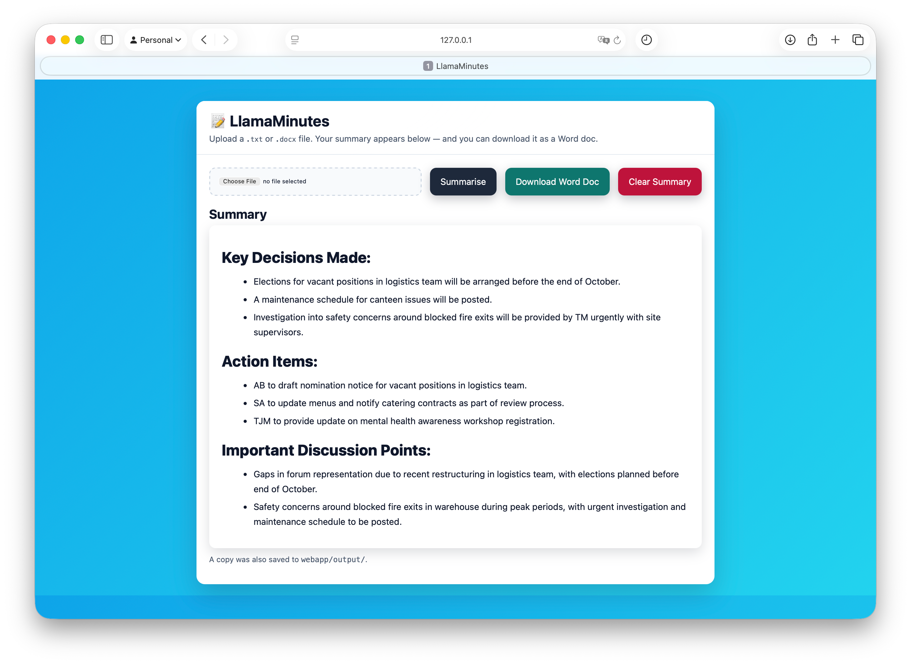

# 📝 LlamaMinutes

**LlamaMinutes** was built by me as a first experiment with local LLMs and CrewAI's agent capabilities. It is a lightweight meeting minutes summariser built with [CrewAI](https://github.com/joaomdmoura/crewai) and [Ollama](https://ollama.com).
Give it a `.txt` or `.docx` of meeting notes and it returns a structured summary in the form of a Word (.docx) document including:

- ✅ Key Decisions  
- ✅ Action Items (with owners if mentioned)  
- ✅ Important Discussion Points  

---

## 🚀 Features

- Runs locally on computer (only tested on MacOS)
- Uses the small, efficient `llama3.2:1b` model in Ollama by default, quick and detailed enough for this task
- Supports `.txt` and `.docx` inputs  
- Prints clean, structured summaries in your terminal  
- Outputs summary as a formatted Word (.docx) document

---

## 📦 Requirements

- macOS with Terminal (VSCode recommended)  
- [Conda](https://docs.conda.io/en/latest/) or Miniconda  
- [Ollama](https://ollama.com) installed and running locally  

---

## ⚙️ Installation

### 🔹 Minimal CLI Requirements
If you just want to run the CLI script (`minimal_minutes.py`) without the web interface, install only the essentials:

```bash
pip install -r min_minutes_req.txt
```

### 1) Clone the repository
```bash
git clone https://github.com/tamasfried/LlamaMinutes.git
cd LlamaMinutes
```

### 2) Create and activate a Conda environment
```bash
conda create -n llama-minutes python=3.11 -y
conda activate llama-minutes
```

### 3) Install Python dependencies
```bash
pip install crewai langchain-ollama python-docx docx2txt
```

### 4) Install & prepare Ollama (model)
If you haven’t already:
```bash
# Ensure the service is running
ollama serve

# Pull the small local model
ollama pull llama3.2:1b
```

---

## ▶️ Usage

Place a minutes file (e.g., `minutes.txt` or `meeting_notes.docx`) in the repo folder and run:

```bash
python minimal_minutes.py minutes.txt
# or
python minimal_minutes.py meeting_notes.docx
```

---

## 🌐 Webapp Version (Optional)

In addition to the CLI script, there is a simple web interface built with Flask.

### Webapp Screenshots

<table>
  <tr>
    <td></td>
    <td></td>
  </tr>
</table>

### Run the webapp
```bash
cd webapp
pip install -r requirements.txt
python app.py
```
Then open http://127.0.0.1:8000 in your browser.
Upload a .txt or .docx file, view the summary in a polished UI, download it as a Word doc, or clear the screen with one click.
Summaries are also auto-saved into webapp/output/.


## 📂 Project Structure

```
LlamaMinutes/
├── minimal_minutes.py        # Main CLI script (CrewAI + Ollama)
├── sample_minutes.txt        # Example minutes txt file for testing
├── sample_minutes.docx       # Example minutes docx file for testing
├── min_minutes_req.txt       # Requirements for the minimal CLI tool
├── README.md                 # Project documentation
├── .gitignore                # Ignore rules
│
├── webapp/                   # Flask-based webapp version
│   ├── app.py                # Web server entry point
│   ├── requirements.txt      # Webapp-specific dependencies
│   ├── output/               # Auto-saved summaries (.txt + .docx)
│   └── templates/
│       └── index.html        # Web interface
│
└── screenshots/              # Images used in README
    ├── Launch.png            # Webapp launch page screenshot
    └── Result.png            # Webapp results page screenshot
```

---


## 🙌 Credits

Built by [@tamasfried](https://github.com/tamasfried) using CrewAI + Ollama.  
